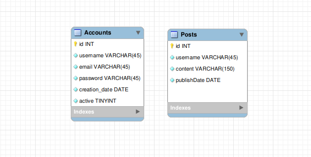

# Social Network Backend
Futuramente no projeto deixarei fotos aqui 📷

## Sobre
Servidor da rede social [Social network](https://github.com/JoaoVMarques/social-network) com todas as opções de logar deslogar
e diversas outras funcionalidades.

## Porque?
Para melhorar minhas habilidades em backend e entender como funciona sistemas e melhorar meu nivel de segurança com node

## 🏆 Objetivos
- [x] Conectar com o banco de dados.
- [x] Rota para criar a conta.
- [x] Criar e mostrar postagens.
- [x] Token de validação.
- [ ] Receber e enviar pedidos de amizade.
- [ ] Mostrar posts de somente as pessoas que voce segue ou é amigo.

## Parte Tecnica

  
<strong>🛠️ Ferramentas Utilizadas</strong>
 

  - [Node](https://nodejs.org/en/) Montar o projeto
  - [MySQL Workbench](https://www.mysql.com/products/workbench/) visualizar banco de dados

  
<strong>🧰 Dependencias</strong>
 

  - [chai-http](https://react-bootstrap.github.io/) Estilizar
  - [chai](https://www.chaijs.com/) Testes
  - [mocha](https://mochajs.org/) Testes
  - [sinon](https://sinonjs.org/) Testes
  - [nodemon](https://www.npmjs.com/package/nodemon) reiniciar automatico
  - [ESlint](https://eslint.org/) Linter

  
<strong>📑 Diagrama Db</strong>
 
  
 #### Diagrama do banco de dados
   

